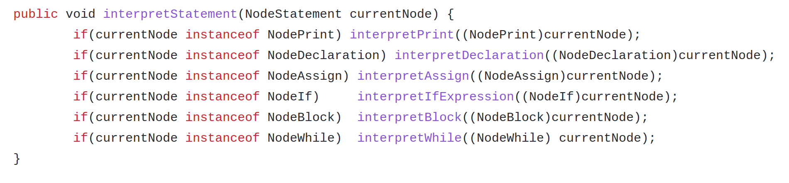

# Interpreter



### Goal of this project

The goal of this project was to learn how to build a simple interpreter. I did this during my first year of computer science studies at ETH.


### Example of intermediate output

```xml
<programm>
	<if>
		<expression>
			<literal value : true >
		</expression>
		<block>
			<print>
				<expression>
					<literal value : 3 >
				</expression>
			</print>
			<declaration>
				<id type : int  identifier : x >
					<expression>
						<literal value : 40 >
					</expression>
			</declaration>
			<assign>
				<id identifier : x >
					<expression>
						<binaryExpression>
							<oprator + >
							<expression>
								<identifier : x >
							</expression>
							<expression>
								<literal value : 15 >
							</expression>
						</binaryExpression>
					</expression>
			</assign>
			<if>
				<expression>
					<binaryExpression>
						<oprator < >
						<expression>
							<identifier : x >
						</expression>
						<expression>
							<literal value : 50 >
						</expression>
					</binaryExpression>
				</expression>
				<block>
					<print>
						<expression>
							<literal value : false >
						</expression>
					</print>
				</block>
			</if>
			<if>
				<expression>
					<binaryExpression>
						<oprator > >
						<expression>
							<identifier : x >
						</expression>
						<expression>
							<literal value : 50 >
						</expression>
					</binaryExpression>
				</expression>
				<block>
					<print>
						<expression>
							<identifier : x >
						</expression>
					</print>
				</block>
			</if>
		</block>
	</if>
	<assign>
		<id identifier : x >
			<expression>
				<literal value : 30 >
			</expression>
	</assign>
	<while>
		<expression>
			<binaryExpression>
				<oprator >= >
				<expression>
					<identifier : x >
				</expression>
				<expression>
					<literal value : 1 >
				</expression>
			</binaryExpression>
		</expression>
		<block>
			<print>
				<expression>
					<identifier : x >
				</expression>
			</print>
			<assign>
				<id identifier : x >
					<expression>
						<binaryExpression>
							<oprator - >
							<expression>
								<identifier : x >
							</expression>
							<expression>
								<literal value : 1 >
							</expression>
						</binaryExpression>
					</expression>
			</assign>
		</block>
	</while>
<programm>

```
